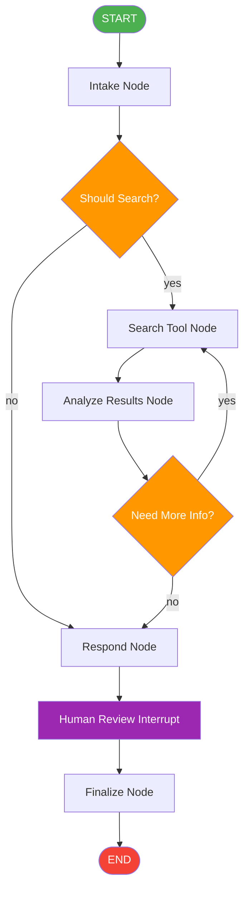

# Capstone Project — Research Assistant Agent

## Architecture Overview

This is a complete **Research Assistant Agent** that combines every concept from the previous 6 sections into one multi-file project. Unlike learning files, this is organized like a real Python project with separate modules.

## What It Does

1. Takes a user question
2. Decides whether to search the web or answer directly (conditional edge)
3. If search: calls a search tool, gets results
4. Feeds results to the LLM for reasoning
5. LLM decides: need more info? (loop back) or ready to answer? (proceed)
6. Generates final response
7. All with checkpointing (MemorySaver for demo, swappable to MongoDB)
8. Human-in-the-loop: pauses before final response for review

## Concepts Used

| Concept | Where it's used |
|---|---|
| StateGraph, nodes, edges | `graph.py` — graph construction |
| TypedDict state | `state.py` — state schema |
| Conditional edges | `graph.py` — search vs direct answer |
| Loops | `graph.py` — search again if needed |
| Reducers | `state.py` — message accumulation |
| LLM integration | `nodes.py` — agent reasoning |
| Mock LLM | `nodes.py` — fallback without API key |
| Tool calling | `tools.py` — search tool |
| Checkpointing | `main.py` — MemorySaver |
| Human-in-the-loop | `graph.py` — interrupt before respond |

## Diagram



## File Organization

| File | Purpose |
|---|---|
| `state.py` | State schema (TypedDict with reducers) |
| `tools.py` | Tool definitions (web search mock) |
| `nodes.py` | All node functions (intake, search, analyze, respond, finalize) |
| `graph.py` | Graph construction + compilation |
| `main.py` | Entry point — runs the complete agent |

## How to Run

```bash
python 06_capstone_project/main.py
```
