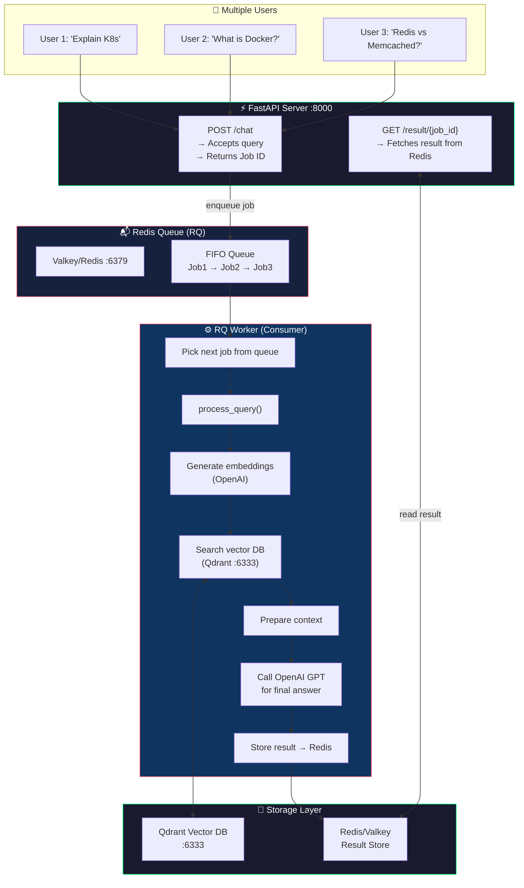
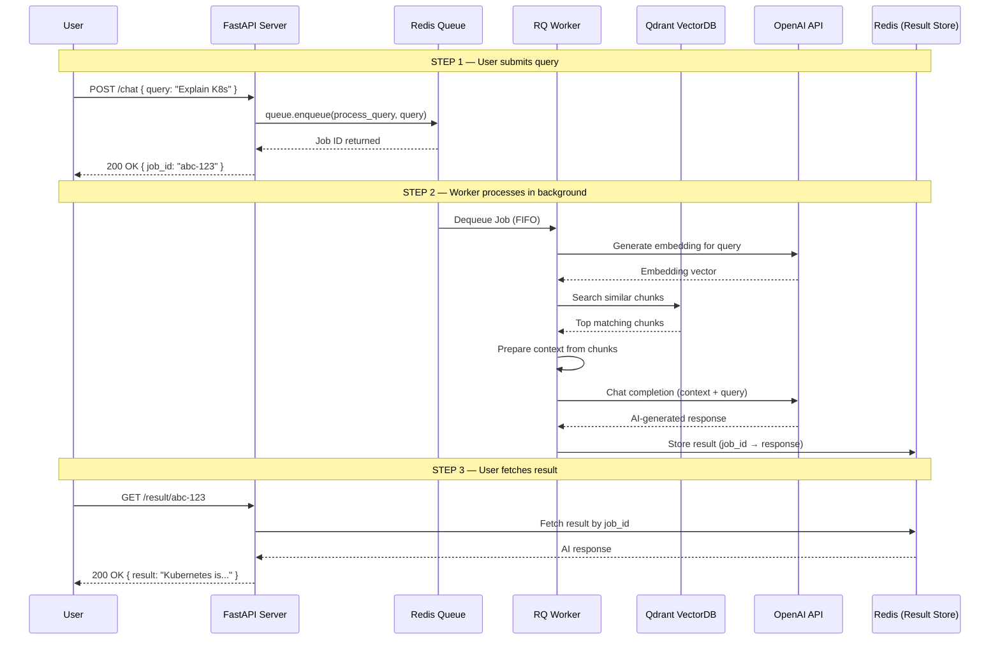

# 🚀 Asynchronous Queues in System Design

## End-to-End Guide: FastAPI + Redis Queue (RQ) + RAG Pipeline

---

> **What you'll learn:** How to build a production-style async processing system where user queries are queued, processed in the background by a worker, and results are fetched on demand — using FastAPI, Python RQ, Redis/Valkey, and a RAG (Retrieval-Augmented Generation) pipeline.

---

## 📌 Table of Contents

1. [The Problem — Why Async?](#1-the-problem--why-async)
2. [The Solution — Queue-Based Architecture](#2-the-solution--queue-based-architecture)
3. [Architecture Flow Diagram](#3-architecture-flow-diagram)
4. [Key Concepts Explained](#4-key-concepts-explained)
5. [Tech Stack Overview](#5-tech-stack-overview)
6. [Step-by-Step Setup](#6-step-by-step-setup)
7. [Complete Code Walkthrough](#7-complete-code-walkthrough)
8. [How It All Ties Together](#8-how-it-all-ties-together)
9. [Testing the System](#9-testing-the-system)
10. [Common Pitfalls & Best Practices](#10-common-pitfalls--best-practices)
11. [Quick Reference Cheatsheet](#11-quick-reference-cheatsheet)

---

## 1. The Problem — Why Async?

### ❌ The Synchronous (Blocking) Approach

Imagine you have a FastAPI server. A user sends a query like:

> *"Hey, can you explain Kubernetes to me?"*

In a **synchronous** setup, here's what happens:

```
User → sends query → Server starts processing → Server is BLOCKED → Response returned
```

**While the server is busy processing this one request:**
- User 2 arrives → ⏳ Waiting...
- User 3 arrives → ⏳ Waiting...
- User 4 arrives → ⏳ Waiting...

**The entire server is blocked** because of ONE user's query. This is a terrible user experience, especially when the processing involves:
- Embedding generation (slow)
- Vector DB search (network I/O)
- LLM API call to OpenAI (very slow, 2-10 seconds)

### 🧠 Real-World Analogy

Think of it like a **restaurant with one chef and no order queue**:
- Customer 1 orders biryani → Chef starts cooking
- Customer 2, 3, 4 walk in → "Sorry, chef is busy. Wait."
- Everyone is blocked until Customer 1's biryani is done

**That's not how restaurants work!** They take your order, give you a token number, and process orders in the kitchen (background). You check back with your token when ready.

**This is exactly what we're going to build.**

---

## 2. The Solution — Queue-Based Architecture

### ✅ The Asynchronous (Non-Blocking) Approach

Instead of processing the request immediately, we:

1. **Accept the request** → "Got it, here's your Job ID"
2. **Push it into a Queue** (FIFO — First In, First Out)
3. **A separate Worker/Consumer** picks up jobs one by one
4. **Worker processes the query** (embedding → search → LLM call)
5. **Result is stored** in Redis
6. **User checks back** with their Job ID → Gets the response

```
User → sends query → Server says "Got it! Job ID: abc123"
                           ↓
                     [QUEUE: FIFO]
                     Job 1 → Job 2 → Job 3
                           ↓
                     [WORKER/CONSUMER]
                     Picks Job 1 → Processes → Stores result in Redis
                           ↓
User → "What's my result?" → Server reads from Redis → Returns response
```

**Now the server is NEVER blocked.** It just accepts requests and enqueues them.

---

## 3. Architecture Flow Diagram

### High-Level System Design



### Request Lifecycle (Sequence)



---

## 4. Key Concepts Explained

### 🔹 What is a Queue?

A **Queue** is a data structure that follows **FIFO** — First In, First Out.

```
ENQUEUE (push) →  [Job1] [Job2] [Job3]  → DEQUEUE (pick)
                   ←——— oldest first ———→
```

- **Enqueue** = Add a new job at the back
- **Dequeue** = Remove and process the job at the front
- **Just like a line at a ticket counter** — whoever comes first gets served first

### 🔹 Producer vs Consumer Pattern

| Role | What it does | In our system |
|------|-------------|---------------|
| **Producer** | Creates and pushes messages/jobs into the queue | FastAPI server (the `/chat` route) |
| **Consumer** | Picks up jobs from the queue and processes them | RQ Worker running `process_query()` |

This is one of the most fundamental patterns in distributed systems. It **decouples** the request-accepting part from the request-processing part.

### 🔹 Redis / Valkey

- **Redis** = In-memory data store, used as a message broker for RQ
- **Valkey** = Open-source, drop-in replacement for Redis (after Redis changed its license)
- **Zero code changes** — anything you write for Redis works on Valkey and vice versa
- In our system, Redis/Valkey serves two purposes:
  1. **Message broker** for the queue (stores the job queue)
  2. **Result store** (stores processed results so users can fetch them)

### 🔹 Python RQ (Redis Queue)

- Lightweight Python library for queueing jobs
- Uses Redis as the backend broker
- Much simpler than Celery for basic use cases
- Key components: `Queue` (producer side), `Worker` (consumer side)

### 🔹 RAG (Retrieval-Augmented Generation)

The worker doesn't just answer from thin air — it follows the RAG pattern:

```
Query → Embed → Search VectorDB → Get relevant chunks → Build context → Send to LLM → Get answer
```

This ensures the AI gives answers grounded in your actual data, not hallucinations.

---

## 5. Tech Stack Overview

| Component | Technology | Port | Purpose |
|-----------|-----------|------|---------|
| HTTP Server | **FastAPI** | `:8000` | Accept requests, return results |
| Queue Broker | **Valkey/Redis** | `:6379` | FIFO job queue + result storage |
| Queue Library | **Python RQ** | — | Enqueue/dequeue jobs in Python |
| Vector Database | **Qdrant** | `:6333` | Store and search document embeddings |
| Embeddings | **OpenAI Embeddings** | — | Convert text → vectors |
| LLM | **OpenAI GPT** | — | Generate final AI responses |
| Containerization | **Docker Compose** | — | Spin up Valkey + Qdrant easily |

---

## 6. Step-by-Step Setup

### Step 1: Project Structure

```
rag_q/
├── .env                    # API keys (OpenAI)
├── docker-compose.yml      # Valkey + Qdrant services
├── main.py                 # Entry point — runs FastAPI with Uvicorn
├── server.py               # FastAPI routes (/chat, /result)
├── client/
│   ├── __init__.py
│   └── rq_client.py        # Redis connection + Queue setup
├── queues/
│   ├── __init__.py
│   └── worker.py           # process_query() — the actual RAG logic
└── requirements.txt        # All dependencies
```

### Step 2: Docker Compose — Spin Up Valkey

Create `docker-compose.yml`:

```yaml
version: "3.8"

services:
  valkey:
    image: valkey/valkey:latest
    container_name: valkey_queue
    ports:
      - "6379:6379"
    volumes:
      - valkey_data:/data
    restart: unless-stopped

  # If Qdrant is not already running from another compose file:
  # qdrant:
  #   image: qdrant/qdrant:latest
  #   container_name: qdrant_vectordb
  #   ports:
  #     - "6333:6333"
  #   volumes:
  #     - qdrant_data:/qdrant/storage

volumes:
  valkey_data:
  # qdrant_data:
```

**Run it:**

```bash
cd rag_q
docker compose up -d
```

**Verify:**

```bash
docker ps
# You should see:
# valkey_queue  → port 6379
# (qdrant should already be running on 6333 from your existing setup)
```

> 💡 **Note:** If you want to use Redis instead of Valkey, just replace the image with `redis:latest`. Absolutely zero code changes needed.

### Step 3: Install Python Dependencies

```bash
pip install rq fastapi[standard] openai qdrant-client python-dotenv uvicorn
```

Then freeze:

```bash
pip freeze > requirements.txt
```

### Step 4: Create the `.env` file

```env
OPENAI_API_KEY=sk-your-openai-api-key-here
```

---

## 7. Complete Code Walkthrough

### 📄 `client/rq_client.py` — Queue Connection Setup

This file sets up the connection to Redis/Valkey and creates a Queue object that we'll use to enqueue jobs.

```python
from redis import Redis
from rq import Queue

# Connect to Valkey/Redis running on localhost:6379
redis_connection = Redis(
    host="localhost",
    port=6379
)

# Create a Queue instance using the Redis connection
# This queue follows FIFO — first job in, first job out
queue = Queue(connection=redis_connection)
```

**What's happening here:**
- `Redis(host, port)` — establishes a connection to our Valkey/Redis instance
- `Queue(connection=...)` — creates an RQ queue that uses this Redis connection as its broker
- This `queue` object has methods like `.enqueue()` to push jobs

### 📄 `client/__init__.py`

```python
# Makes the client folder a Python package
# Allows: from client.rq_client import queue
```

### 📄 `queues/worker.py` — The Consumer (RAG Processing Logic)

This is where the actual heavy lifting happens. When a job is dequeued, this function runs.

```python
from openai import OpenAI
from qdrant_client import QdrantClient
from qdrant_client.models import PointStruct
import os

# Initialize clients
openai_client = OpenAI(api_key=os.getenv("OPENAI_API_KEY"))
qdrant_client = QdrantClient(host="localhost", port=6333)

# Configuration
COLLECTION_NAME = "my_documents"       # Your Qdrant collection name
EMBEDDING_MODEL = "text-embedding-ada-002"
CHAT_MODEL = "gpt-4"


def get_embedding(text: str) -> list:
    """Convert text to a vector embedding using OpenAI."""
    response = openai_client.embeddings.create(
        input=text,
        model=EMBEDDING_MODEL
    )
    return response.data[0].embedding


def process_query(query: str) -> str:
    """
    THE MAIN WORKER FUNCTION
    
    This runs inside the RQ worker (consumer), NOT on the FastAPI server.
    
    Steps:
    1. Convert user query → embedding vector
    2. Search Qdrant vector DB for similar chunks
    3. Prepare context from matched chunks
    4. Send context + query to OpenAI GPT
    5. Return the AI-generated answer
    """
    
    # ── Step 1: Generate embedding for the query ──
    print(f"📥 Received query: {query}")
    print("🔍 Generating embedding...")
    query_embedding = get_embedding(query)
    
    # ── Step 2: Search the Vector Database ──
    print("🔎 Searching vector DB for relevant chunks...")
    search_results = qdrant_client.search(
        collection_name=COLLECTION_NAME,
        query_vector=query_embedding,
        limit=5  # Get top 5 most relevant chunks
    )
    print(f"✅ Found {len(search_results)} matching chunks")
    
    # ── Step 3: Prepare context from search results ──
    context_chunks = []
    for result in search_results:
        chunk_text = result.payload.get("text", "")
        context_chunks.append(chunk_text)
    
    context = "\n\n---\n\n".join(context_chunks)
    print(f"📋 Context prepared ({len(context)} characters)")
    
    # ── Step 4: Build the prompt with system instructions ──
    system_prompt = """You are a helpful AI assistant. Answer the user's question 
    based ONLY on the provided context. If the context doesn't contain enough 
    information to answer, say so honestly. Be concise and accurate."""
    
    # ── Step 5: Call OpenAI for the final answer ──
    print("🤖 Calling OpenAI for response...")
    chat_response = openai_client.chat.completions.create(
        model=CHAT_MODEL,
        messages=[
            {"role": "system", "content": system_prompt},
            {"role": "user", "content": f"Context:\n{context}\n\nQuestion: {query}"}
        ]
    )
    
    response_text = chat_response.choices[0].message.content
    print(f"✅ Response generated ({len(response_text)} characters)")
    
    return response_text
```

**What's happening here:**
- This function is the **consumer/processor** — it does the actual RAG work
- It's NOT called directly by FastAPI — it's enqueued and run by the RQ Worker process
- The 5-step RAG flow: Embed → Search → Context → Prompt → LLM Response

### 📄 `queues/__init__.py`

```python
# Makes the queues folder a Python package
```

### 📄 `server.py` — FastAPI Routes (Producer)

```python
from fastapi import FastAPI, Query
from client.rq_client import queue
from queues.worker import process_query

app = FastAPI(
    title="Async RAG Queue API",
    description="Submit queries asynchronously using Redis Queue"
)


# ── Health Check ──
@app.get("/")
def health_check():
    """Simple health check to verify server is running."""
    return {"status": "Server is up and running 🚀"}


# ── ROUTE 1: Submit a query (Producer) ──
@app.post("/chat")
def chat(query: str = Query(..., description="Your question")):
    """
    Accepts a user query and pushes it into the Redis Queue.
    Returns a Job ID immediately — the server is NOT blocked.
    
    The actual processing happens in the background via the RQ Worker.
    """
    # Enqueue the process_query function with the user's query
    job = queue.enqueue(process_query, query)
    
    return {
        "message": "Your query has been queued for processing ⏳",
        "job_id": job.id,
        "status": "queued",
        "tip": f"Check your result at: GET /result/{job.id}"
    }


# ── ROUTE 2: Fetch result (Read from Redis) ──
@app.get("/result/{job_id}")
def get_result(job_id: str):
    """
    Fetches the result of a previously submitted job.
    
    Possible statuses:
    - queued: Job is waiting in the queue
    - started: Worker has picked it up and is processing
    - finished: Done! Result is ready
    - failed: Something went wrong during processing
    """
    from rq.job import Job
    from client.rq_client import redis_connection
    
    try:
        job = Job.fetch(job_id, connection=redis_connection)
    except Exception:
        return {"error": "Job not found. Check your Job ID."}
    
    if job.is_finished:
        return {
            "job_id": job_id,
            "status": "finished ✅",
            "result": job.result
        }
    elif job.is_failed:
        return {
            "job_id": job_id,
            "status": "failed ❌",
            "error": str(job.exc_info)
        }
    else:
        return {
            "job_id": job_id,
            "status": job.get_status(),
            "message": "Still processing... try again in a few seconds ⏳"
        }
```

**What's happening here:**
- `POST /chat` — This is the **producer**. It takes the query, enqueues it, and immediately returns a Job ID. The server is free to handle the next request.
- `GET /result/{job_id}` — This lets the user check back. It reads the job status from Redis and returns the result if finished.

### 📄 `main.py` — Entry Point

```python
import uvicorn
from dotenv import load_dotenv

# Load environment variables (.env file) BEFORE importing the app
# This ensures OPENAI_API_KEY is available everywhere
load_dotenv()

from server import app

def main():
    """Start the FastAPI server using Uvicorn."""
    uvicorn.run(
        app,
        host="0.0.0.0",   # Accept connections from any IP
        port=8000           # Server runs on http://localhost:8000
    )

if __name__ == "__main__":
    main()
```

---

## 8. How It All Ties Together

### Running the System (3 Terminal Windows)

You need **three** separate terminal windows to run the full system:

**Terminal 1 — Start Valkey + Qdrant (Infrastructure)**

```bash
cd rag_q
docker compose up -d
```

**Terminal 2 — Start the FastAPI Server (Producer)**

```bash
cd rag_q
python -m main
# Output: Uvicorn running on http://0.0.0.0:8000
```

**Terminal 3 — Start the RQ Worker (Consumer)**

```bash
cd rag_q
rq worker --with-scheduler
# Output: Worker started, listening on default queue...
```

> ⚠️ **Critical:** If you don't start the RQ Worker, jobs will pile up in the queue and never get processed. The worker is the consumer that actually does the work.

### The Complete Data Flow

```
[User sends POST /chat?query="What is Docker?"]
        ↓
[FastAPI receives request]
        ↓
[queue.enqueue(process_query, "What is Docker?")]
        ↓
[Job pushed to Redis Queue → Job ID returned to user]
        ↓
[RQ Worker picks up the job (FIFO)]
        ↓
[process_query("What is Docker?") runs:]
    1. Embed query → OpenAI Embeddings API
    2. Search Qdrant → Get top 5 chunks
    3. Build context from chunks
    4. Send to OpenAI Chat API → Get answer
    5. Return result → Stored in Redis automatically by RQ
        ↓
[User sends GET /result/{job_id}]
        ↓
[FastAPI reads result from Redis → Returns to user]
```

---

## 9. Testing the System

### Using the FastAPI Swagger UI

Open your browser → `http://localhost:8000/docs`

This gives you an interactive API documentation where you can test both routes directly.

### Using cURL

**Submit a query:**

```bash
curl -X POST "http://localhost:8000/chat?query=What%20is%20Kubernetes"
```

**Response:**

```json
{
  "message": "Your query has been queued for processing ⏳",
  "job_id": "a1b2c3d4-e5f6-7890-abcd-ef1234567890",
  "status": "queued",
  "tip": "Check your result at: GET /result/a1b2c3d4-e5f6-7890-abcd-ef1234567890"
}
```

**Check the result (after a few seconds):**

```bash
curl "http://localhost:8000/result/a1b2c3d4-e5f6-7890-abcd-ef1234567890"
```

**Response (when finished):**

```json
{
  "job_id": "a1b2c3d4-e5f6-7890-abcd-ef1234567890",
  "status": "finished ✅",
  "result": "Kubernetes is an open-source container orchestration platform..."
}
```

### Using Python `requests`

```python
import requests
import time

# Step 1: Submit query
response = requests.post(
    "http://localhost:8000/chat",
    params={"query": "Explain Redis caching patterns"}
)
job_id = response.json()["job_id"]
print(f"Job submitted! ID: {job_id}")

# Step 2: Poll for result
while True:
    result = requests.get(f"http://localhost:8000/result/{job_id}")
    data = result.json()
    
    if data["status"] == "finished ✅":
        print(f"Answer: {data['result']}")
        break
    elif "failed" in data["status"]:
        print(f"Error: {data.get('error')}")
        break
    else:
        print(f"Status: {data['status']}... waiting")
        time.sleep(2)  # Check every 2 seconds
```

---

## 10. Common Pitfalls & Best Practices

### ❌ Pitfalls to Avoid

| Pitfall | What Happens | Fix |
|---------|-------------|-----|
| Forgetting to start the RQ Worker | Jobs queue up but never process | Always run `rq worker` in a separate terminal |
| Not loading `.env` before app starts | `OPENAI_API_KEY` is None, API calls fail | Call `load_dotenv()` at the very top of `main.py` |
| Redis/Valkey not running | `ConnectionError` when enqueuing | Run `docker compose up -d` first |
| No `__init__.py` in folders | Python can't import modules | Add empty `__init__.py` to `client/` and `queues/` |
| Hardcoding API keys | Security risk if pushed to Git | Always use `.env` + `.gitignore` |

### ✅ Best Practices

- **Always use job IDs** — Never try to return results synchronously from an async system
- **Add timeout to workers** — `rq worker --timeout 120` prevents jobs from hanging forever
- **Monitor your queue** — Use `rq info` to see queue length, failed jobs, workers
- **Handle failures gracefully** — Always check job status (queued/started/finished/failed)
- **Use Docker for everything** — Keep Redis, Qdrant, and even your app containerized
- **Scale workers horizontally** — Need more throughput? Just start more worker processes

---

## 11. Quick Reference Cheatsheet

### Commands

```bash
# Start infrastructure
docker compose up -d

# Start FastAPI server
python -m main

# Start RQ worker
rq worker

# Check queue status
rq info

# Check running containers
docker ps

# Install dependencies
pip install rq fastapi[standard] openai qdrant-client python-dotenv uvicorn
```

### Key Code Patterns

```python
# ENQUEUE a job (Producer side)
from client.rq_client import queue
from queues.worker import process_query

job = queue.enqueue(process_query, "user query here")
print(job.id)  # Save this to return to the user

# FETCH a job result (Result side)
from rq.job import Job
from client.rq_client import redis_connection

job = Job.fetch("job-id-here", connection=redis_connection)
if job.is_finished:
    print(job.result)
```

### Port Reference

| Service | Port | URL |
|---------|------|-----|
| FastAPI | 8000 | `http://localhost:8000` |
| FastAPI Docs | 8000 | `http://localhost:8000/docs` |
| Redis/Valkey | 6379 | `redis://localhost:6379` |
| Qdrant | 6333 | `http://localhost:6333` |

---

## 🧠 Key Takeaways

1. **Never block your server** for heavy processing — always use queues
2. **Producer-Consumer pattern** decouples request handling from processing
3. **Redis Queue (RQ)** is the simplest way to add job queues in Python
4. **Valkey** is a drop-in replacement for Redis (identical API, open-source license)
5. **The 3-process setup**: FastAPI server + RQ Worker + Redis — that's your production async system
6. **RAG + Queues** = Scalable AI applications that don't choke under load

---

> **Built with:** FastAPI • Python RQ • Redis/Valkey • Qdrant • OpenAI • Docker Compose
